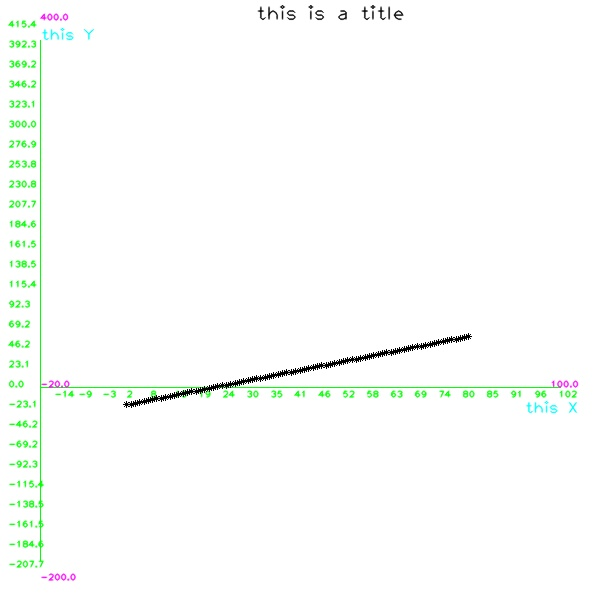
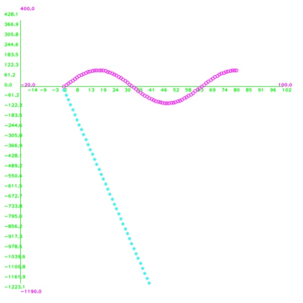

# testPolt
实现Matlab风格的opencv    plot类
#plot.h 头文件使用说明
[toc]
##功能
Matlab style plot functions for OpenCV
author libing64 && Jack Dong
原代码地址 : https://github.com/libing64/CPlot
我修改完善后的地址：
功能预览：

中间是图表的标题（只支持英文，中文会乱码），XY轴两端的红色数字表示输入数据XY的最小最大值，青色是XY轴的数据的意义的标示（同样只支持英文，颜色可自定义），XY轴刻度线自动生成。可以选择不同的形状来表示点（支持多种线型，多种颜色，可选择点雨点之间是否用直线连接）。
##说明
这个头文件中包含了两个类，`CPlot`和`Plot`，Plot继承自CPlot，两个类都是实现的一样的功能，不同的地方在于Cplot提供`C` 风格 `opencv1.x`参数和返回值，而Plot提供`C++` 风格`opencv2.x`参数的支持。比较而言，Plot比CPlot使用更简单。
##使用
###CPlot
参数设定：
```
public：
	double y_max; //默认为输入数据Y的最大值
	double y_min;
	double x_max;
	double x_min;
	int border_size;	//边界大小 默认为40个像素大小
```
这几个参数可手动设定，但如果你设置的参数不合适那么还是会使用默认参数。
```
public:
	CvScalar backgroud_color; //背景默认白色
	CvScalar axis_color; //坐标轴及刻度颜色默认为黑色
	CvScalar text_color; //坐标上表示最大最小值的标签的颜色默认为红色
```
```
默认的输出的图表的大小由宏定义给出：
#define WINDOW_WIDTH 800
#define WINDOW_HEIGHT 800
```
以上参数如果要自定义必须在调用plot方法之前设定好。
```
public：
void title(string title_name,CvScalar title_color); 	
	void xlabel(string xlabel_name, CvScalar label_color);
	void ylabel(string ylabel_name, CvScalar label_color);
```
设置标题和XY轴意义的标签，这些标签都不支持中文，只支持英文。有解决中乱码的方法，但是太过复杂。
```	
public:
	//两种输入XY轴数据的方式
	template<class T>
	void plot(T *y, size_t Cnt, CvScalar color, char type = '*',bool is_need_lined = true);	
	template<class T>
	void plot(T *x, T *y, size_t Cnt, CvScalar color, char type = '*',bool is_need_lined = true);
```
这两个方法都由泛型实现，方便传入不同类型的参数，第一个方法没有X轴的数据那么X轴默认是从0 开始的整数（0，1，2，3...）。参数的含义分别为 x轴数据数组；Y轴数据数组；数组的长度；画线的颜色；画线的类型（默认为‘*’）；点与点之间是否用直线连接（默认为true连接）；
关于画线的类型，支持以下线形：
```
//l (小写)       直线	
//*              星 
//.              点 
//o(小写)         圈 
//x(小写)         叉 
//+             十字 
//s(小写)        方块 
```

如果需要在同一张图上画出多张曲线，只需要多次调用plot方法，每次调用plot方法的时候对象会把数据存储起来，如果想清除先前存储的数据，可以调用下面的clear（）方法：
```	
public:
	//清空图片上的数据
	void clear();
```
```
public:
	IplImage* Figure;
```
plot方法不会直接返回结果，会把结果图像存在`Figure`这个成员当中（防止多次申请和释放内存），在调用plot方法后，直接访问Figure成员即可获得结果。
###Plot
Plot的使用相比较CPlot来说，只是有两个地方不同，plot方法和 获得结果图像。
```
public:
	//重载这两个函数 传参简单
	template<class T>
	void plot( vector<T> Y,CvScalar color, char type = '*',bool is_need_lined = true);	
	template<class T>
	void plot(vector< Point_<T> > p,CvScalar color, char type = '*',bool is_need_lined = true);
	//增加一个函数把C版本的 IplImage 转换成Mat
	Mat figure()
	{
		return Mat(this->Figure);
	}
```
在给plot传XY数据的时候直接传入点的向量即可，获取结果图像的时候需要调用`Mat figure();`方法。
##注
这个类依赖于opencv库，要使用此类需要配置opencv2.X以后的版本，代码在opencv2.4.6，vs2012下测试通过。代码还有一些不规范的地方，如果需要自行再扩展与优化，可fork我的项目，或下载我的代码直接修改。
